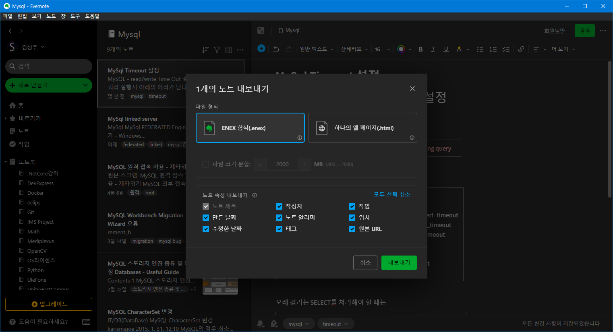
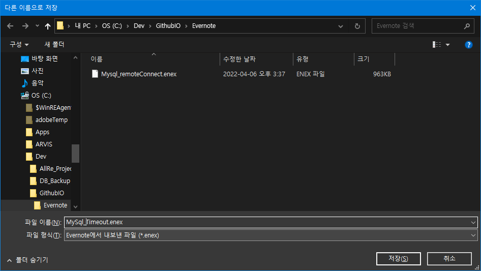
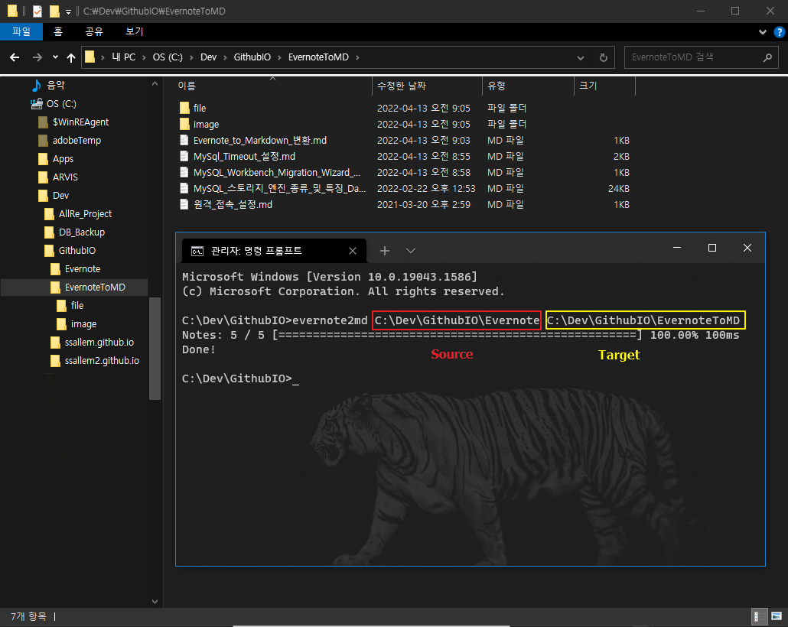

# 1. evernote2md 파일을 다운로드 한다.
[Evernote2Md Github](https://github.com/wormi4ok/evernote2md)

```
### How to use

evernote2md (flags) [input] [outputDir]
```
<br>

📌 [evernote2md.exe](file/evernote2md.exe)

<br>

# 2. 변환할 Evernote 노트들을 1개 폴더에 모아둔다.




```
선택된 노트 관련된 Category 폴더에 Enex 확장자로 내보내기 후 
해당 폴더 전체를 한번에 mark down 형식으로 변환한다. 
```

# 3. evernote2md.exe 파일로 해당 명령어를 입력한다. 😄
